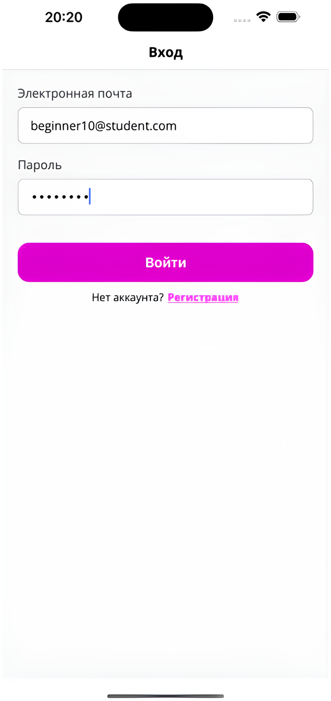
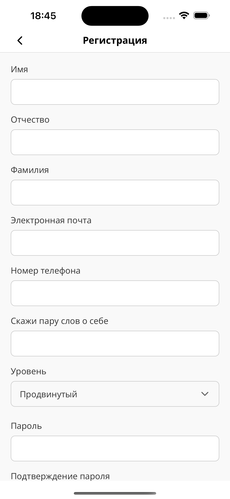
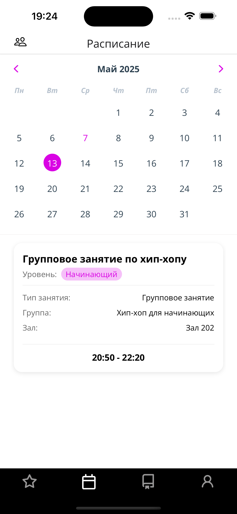
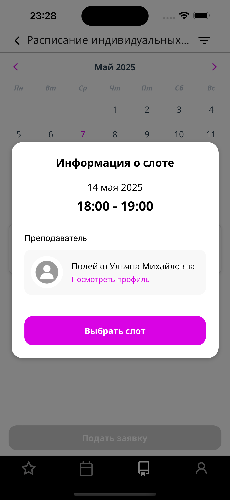
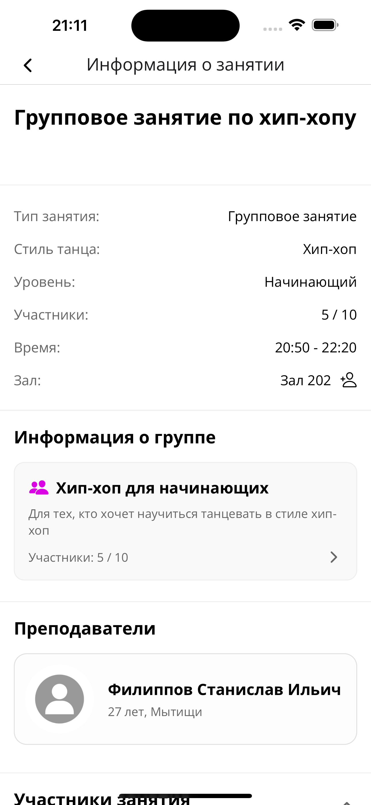
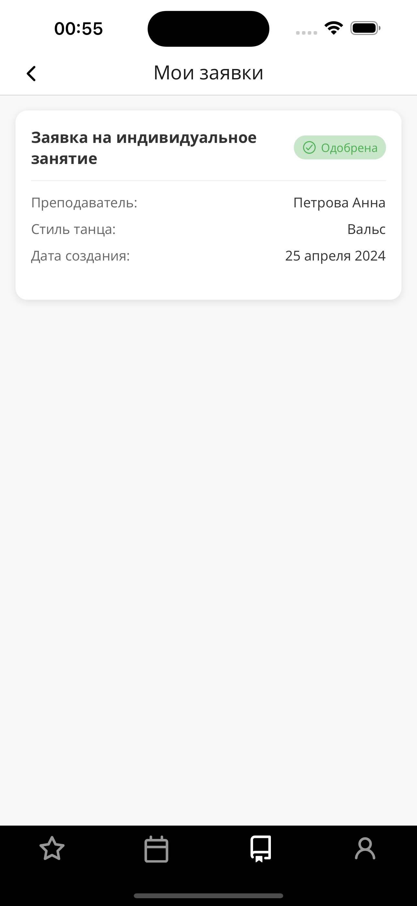
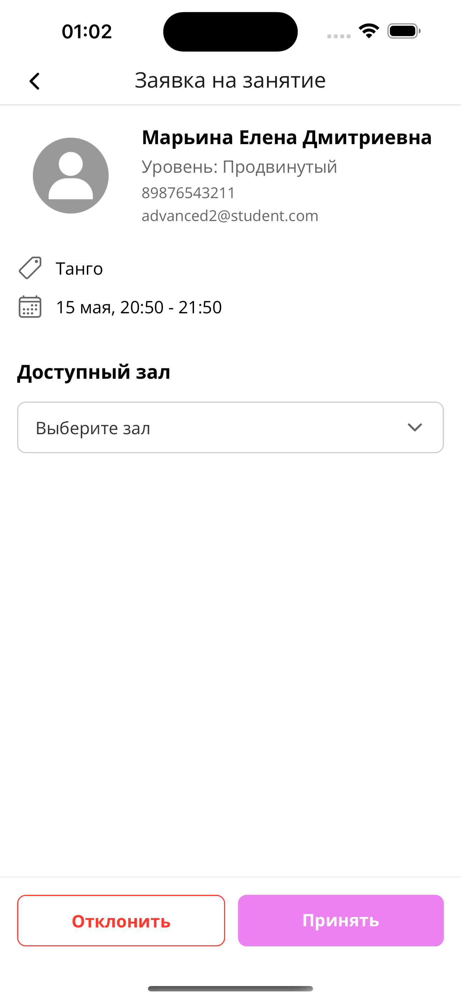
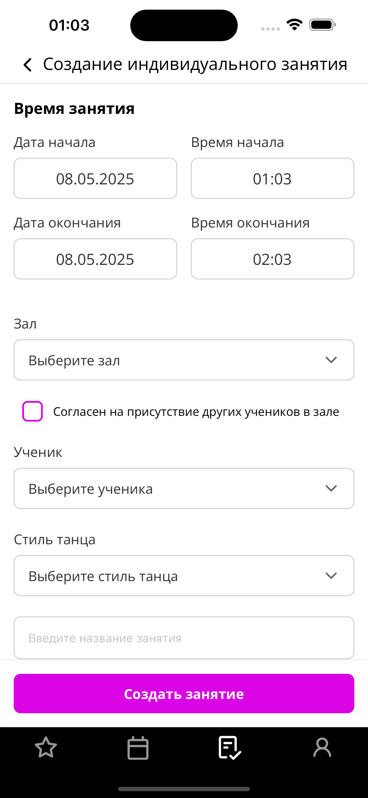

# 📱 Mobile App for Dance School

A cross-platform mobile application for a dance school, developed as part of a client-server system.  
The app is designed for students and teachers to manage schedules, classes, and school events in a convenient and user-friendly way.

## 🚀 Features

### Student
- View class schedule
- Sign up for group and individual classes
- View upcoming school events
- Access personal schedule and class details

### Teacher
- Create and manage classes
- Manage schedule and time slots
- View and manage enrolled students
- Create and manage events

## 🧩 Functional Scope
- User authentication and authorization
- Role-based access (student / teacher)
- Schedule and class management
- Event tracking
- Interaction with backend via REST API
- Cross-platform support (iOS / Android)

## 🖼️ Screenshots

### Authentication & Registration
<!-- Replace paths with real images -->
<p align="center">
  
  
  
</p>

### Schedule & Classes
<p align="center">
  
  
  
</p>

### Teacher Features
<p align="center">
  
  
  
</p>

## 🛠️ Tech Stack

- **React Native** — cross-platform mobile development
- **Expo** — development and build tooling
- **JavaScript / TypeScript**
- **REST API** — server communication
- **JWT** — authentication
- **Redux** — state management
- **AsyncStorage / SecureStore** — local data storage

## 🏗️ Architecture

The application follows a modular architecture with elements inspired by MVVM:

- UI layer (screens & components)
- State and data management
- Network layer (API communication)
- Shared utilities and helpers

This approach improves scalability, testability, and maintainability of the codebase.

## 📂 Project Structure (simplified)
```
src/
├── app/ # All screens source code
├── components/ # Reusable UI components
├── redux/ # State management
├── assets/ # Assets folder
├── constants/ # App constants 
├── validation/ # Validation schemas 
└── utils/ # API and network logic with helper functions 
```
## ▶️ Getting Started

Install dependencies:
```bash
npm install
```

Start the app
```bash
npm start
```

Or run on a specific platform directly:
```bash
npm run android
npm run ios
```
